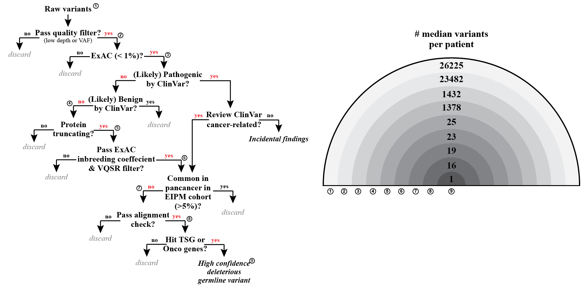

# DGVar

## Overview
DGVar is developed for identifying high confidence germline deleterious variants (DGVs) based on whole-exome sequencing data. The tool takes BAM files or VCF files as input, and screens DGVs by going through a series of flitering steps (please see the above workflow chart). 

## System requirements
DGVar was developed and tested on linux system. To run DGVar, you'll need a linux system and the following softwares being installed:
- Python v2.7+
- Java v1.7+
- Samtools v0.1.19
- Genome Analysis Toolkit v2.5.2
- snpEff v4.2

## Pre-compiled database
The following databases are required:
- Human GRCh37 reference genome
- NCBI dbSNP v137
- snpEff database GRCh37.75
- NCBI ClinVar v20180805 (slim version available in `db` folder)
- ExAC v0.3.1 (slim version available in `db` folder)
- Exome target regions (Agilent HaloPlex bed file available in `db` folder)
- dbNSFP v2.9.1 (optional)

## Installation
No installation is needed. The current version includes the codes used for retrieving DGVs from WCM UC cohort. A standalone version will be in the next release.

## Instructions for use
To run DGVar:
- Update the path in the main shell script `call_variants.sh`
- Run shell script `sh call_variants.sh`

An example input and output file can be found in the `eg` folder. 

Expected run time may vary (10-30 min) depending on input file size and your computing resources.

